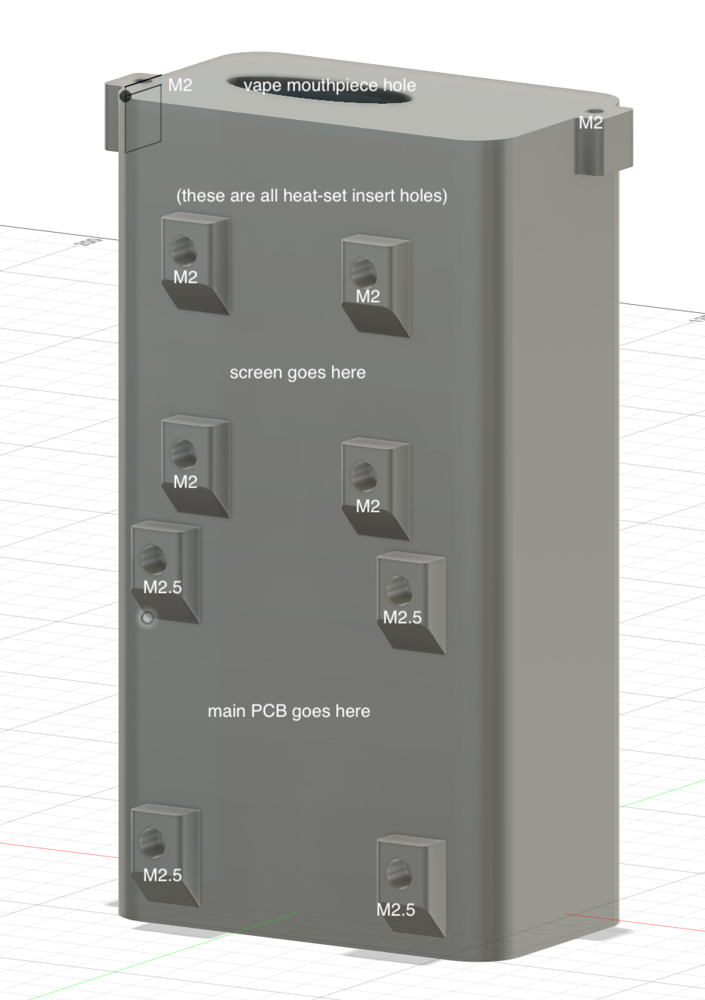

# tamagotchi that dies if you stop vaping
...has been rewritten in Rust. we also made it die if you _keep_ vaping.

## dirs
```
.
├── assets # animation sprites etc
├── case # fusion360 files for 3d-printed case
├── ee # kicad, components, assembly
├── readme.txt # you are here
├── scripts # one offs
├── vg2 # vestigial C++ stm32ide build
└── vgrs # new rust build <- USE THIS ONE
```

# Hardware
## Case
Initially we used a bc5000 vape because it's small and cute.
Right now bc5000 is too small to fit all the hardware, so we use a gimi30k instead.


Eventually I want to target the bc5000 because it's cuter but I'd have to redesign the PCB



## Pinout


```
| Pin  | Function        |
|------|-----------------|
| PA5  | SCREEN_CLK      |
| PA6  | SCREEN_RES      |
| PA7  | SCREEN_DIN      |
| PA8  | SCREEN_DC       |
| PB10 | SCREEN_CS       |
| PB3  | Left Button     |
| PA0  | Middle Button   |
| PB2  | Right Button    |
| PA4  | Coil Input      |
| PB11 | Coil Enable     |
| PA1  | Programmable LED|
```
By default, the vape's heating coil is disabled via a MOSFET. Pull `PB11 (Coil Enable)` high to allow the coil to turn on when user hits the vape.
When user tries to hit the vape, `PA4 (Coil Input)` will go high, regardless of `PB11` state.

# Software
## Building

Either use `nix-shell`, or manually install `cargo` with `thumbv6m-none-eabi` target and `probe-rs`.
```
cd vgrs
nix-shell
cargo build --release --target thumbv6m-none-eabi # build
sudo probe-rs run --chip STM32L072CBTx target/thumbv6m-none-eabi/release/vgrs # flash
```

